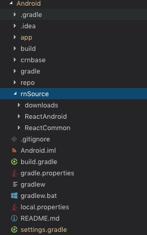
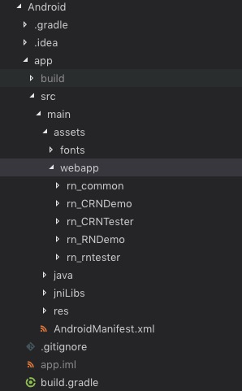

### 在现有Android工程中接入CRN

1.将CRNDemo中 crnbase， rnSource, repo 目录拷贝至待接入工程顶级目录



2.配置相关module

引入crnbase, ReactAndroid module

settings.gradle
```
include ':ReactAndroid',':crnbase'
if (!settings.hasProperty("useReactAndroidSource") || Boolean.parseBoolean(useReactAndroidSource)) {
    include ':ReactAndroid'
    project(':ReactAndroid').projectDir = new File(rootProject.projectDir, './rnSource/ReactAndroid')
}
```

将原有项目对ReactNative依赖改为对crn的依赖：
```
dependencies {
    ...
    // implementation "com.facebook.react:react-native:+"  // From node_modules
    implementation project(':crnbase')
    ...
}
```
其中ReactAndroid包含RN官方c++代码，需要配置好NDK环境，且第一次编译比较耗时。

如果没有改动RN底层c++代码的需求，可以直接使用ReactAndroid aar包, 在接入工程顶级目录build.gradle中加入本地仓库：
```
allprojects {
    repositories {
        ...
        maven {
            url = "$rootDir/repo"
        }
        ...
    }
}

```
并在gradle.properties中关闭源码编译开关：
```
useReactAndroidSource=false
```

3.将用CRN-CLI打包的产物添加到assets/webapp目录



4.启动逻辑中添加代码处理代码并预加载框架代码，可参考CRNDemo中的启动逻辑:

```
// 安装rn_commom
PackageManager.installPackageForProduct("rn_common");

// 预加载common
CRNInstanceManager.prepareReactInstanceIfNeed();

// 打开CRN页面
CRNURL crnurl = new CRNURL(url);
Intent intent = new Intent(MainActivity.this, CRNBaseActivity.class);
intent.putExtra(CRNBaseActivity.INTENT_COMPONENT_NAME, crnurl);
startActivity(intent);
```
