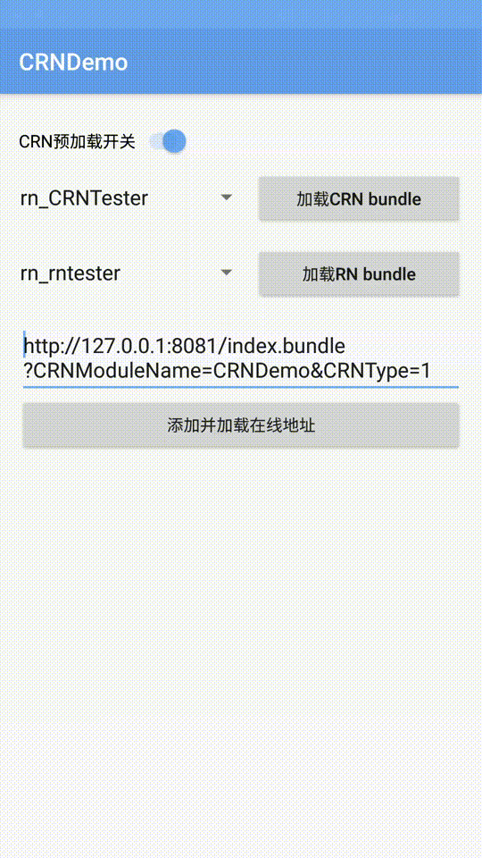
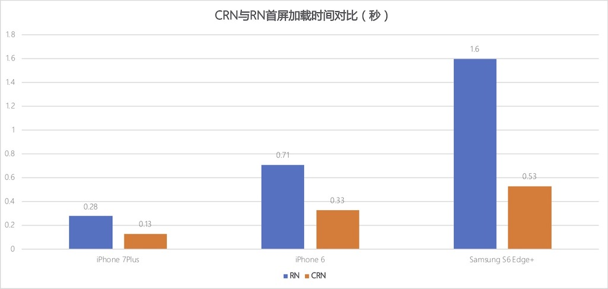

## CRN
CRN是Ctrip React Native简称，由携程无线平台研发团队基于React Native框架优化，定制成稳定性和性能更佳、也更适合业务场景的的跨平台开发框架。

本次开源基于`ReactNative 0.59.0, react 16.8.3`版本, 开源的主要是性能优化部分, 也是规模化使用RN进行业务开发必须要做的优化。

### 一、 功能列表
- 打包支持框架和业务代码拆分
- 支持框架代码后台预加载
- 打包支持增量编译(同一模块，两次打包模块ID不变)
- iOS&Android统一一套打包产物
- 首屏加载性能统计
- [LazyRequire](./resources/lazyRequire.md)

### 二、 如何运行

开源代码中的iOS/Android Demo工程可以运行起来，参考以下操作步骤。

1. RN运行环境搭建，参考[官方文档](https://facebook.github.io/react-native/docs/getting-started)
2. 进入iOS目录，使用`xcode`打开`./iOS/CRNDemo/CRNDemo.xcodeproj`工程，运行
3. 进入Android目录，使用`Android Studio`导入`./Android`工程，Run
   


### 三、 CRN性能数据

以Demo工程为例，运行RN官方tester项目。分别在iPhone 7Plus、iPhone 6、Samsung S6 Edge+手机上测试页面的首屏加载时间，对比图如下。



可见CRN优化后的页面首屏加载时间与优化前RN官方的方式相比在iOS上减少了50%左右，Android上减少了60%左右，优化效果明显。

### 四、 对官方RN的修改
CRN是基于ReactNative定制的，我们对其Runtime、CLI工具代码，都有调整。
主要改动点包括：

-  支持拆分之后的包运行, 针对CRN打包格式的nativeRequire实现
-  增强稳定性，主要是Android平台, 大量的异常处理和保护
-  跨平台共享一份代码、资源, CRN-CLI内部实现

 有兴趣的同学可以研究我们的改造点，具体改造点我们都有相应的注释：
- iOS - 在iOS目录搜索CRN_OPT宏
- Android - 在Android目录搜索注释'CRN BEGIN'和'CRN END'
- CLI - 在packages/crn-cli目录搜索'CRN BEGIN'和'CRN END'

### 五、 CRN-CLI的使用
以上是开源代码的的工程结构及DEMO运行效果，实际开发过程中，不需要关注这些细节，我们可以直接使用CRN-CLI脚手架进行开发调试和打包。

为了方便使用，我们将该开源的CRN-CLI工具发布到了npmjs.com，安装之后可以直接使用，具体使用参考[详情](./packages/crn-cli/README.md)。

### 六、 如何接入
为了方便接入，需首先安装crn-cli， 执行 `npm install -g crn-cli` 即可

#### 1. 全新工程接入
- `crn-cli init <project-name>` 初始化工程，里面包含iOS、Android、JS代码
- `crn-cli run-ios` , `crn-cli run-android` 运行RN工程，进行开发调试
- `crn-cli pack` 打包，并将打包产物拷贝到Native工程的webapp目录

#### 2. 现有工程接入

-  JS代码部分

    只需在现有JS入口模块文件如`index.js`中添加一行模块导出代码即可，示例如下：

  ```
  //index.js
  AppRegistry.registerComponent(appName, () => App);
  module.exports = App; //添加此行代码，导出入口模块即可
  ```

-  Native Runtime接入
   - [iOS参考](./iOS/README.md)
   - [Android参考](./Android/README.md)

### 七、 其它
- 具体优化方案和思路可以参考先前的分享文章[干货 | 近万字长文详述携程大规模应用RN的工程化实践](https://mp.weixin.qq.com/s/Z1GUJW3qBqDGH1jnGt5qAg)
- 欢迎各位同行提issue和PR


### License

CRN is MIT licensed, as found in the [LICENSE](#LICENCE) file.
